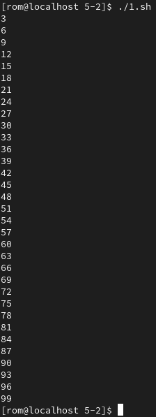
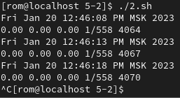
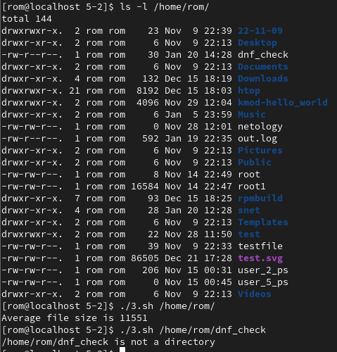
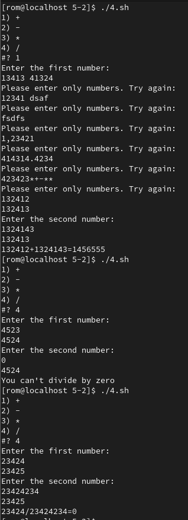

# Домашнее задание к занятию "Циклы и функции." 

------
### Задание 1.

Напишите скрипт.

Скрипт должен выводить на экран все числа от 1 до 100, которые делятся на 3.

Для выполнения задания используйте цикл.

[Решение](code/5-02/1.sh)

------
### Задание 2.

Напишите скрипт, который каждые 5 секунд будет выводить на экран текущее время и содержимое файла `/proc/loadavg`.

Для выполнения задания используйте цикл.

[Решение](code/5-02/2.sh)

------
### Задание 3.

Напишите функцию для подсчета среднего размера файла в директории. 

 - путь к директории должен передаваться параметром, например `avgfile /home/username`;
 - функция должна проверять, что такая директория существует, подсчитывать и выводить на экран средний размер файла в ней;
 - при подсчете не нужно учитывать поддиректории и символьные ссылки, считать только средний размер файлов в заданной директории.
 - для вывода среднего достаточно использовать целочисленное значение (стандартное деление в bash)

Предлагается выполнить задание сначала без открытия подсказки своим способом, при возникновении сложностей воспользоваться подробным алгоритмом решения, который описан ниже.

  
Подсказка - Примерный алгоритм решения

  1. В скрипте объявите функцию. Поместите аргумент в переменную с понятным названием. Проверьте, существует ли заданная в аргументе директория с помощью if.

  2. Внутри функции объявите вспомогательные переменные. Одна переменная будет служить для сохранения суммы размеров всех файлов в директории, а другая будет содержать количество файлов.

  3. Для перебора файлов внутри директории используйте цикл for.

  4. Внутри цикла с помощью if проверяйте, является ли данный объект файлом.

  5. Если это файл, то к переменной суммы добавляйте размер файла и увеличивайте на один переменную с количеством файлов (получить размер одного файла можно с помощью `stat -c "%s" filename`).

  6. После выхода из цикла for (перебора всех файлов в директории), разделите значение переменной с суммой размеров файлов на количество этих файлов и выведите результат на экран.

  7. В конце скрипта, вызовите только что написанную функцию с аргументом, например `avgfile $1`

  8. Запускайте скрипт `./script3.sh /home/username` и смотрите результат. 
 
  9. (необязательно) Если все работает, данную функцию можно добавить к себе в `.bash_profile` и использовать для работы.

[Решение](code/5-02/3.sh)

------
## Дополнительные задания (со звездочкой*)

Эти задания дополнительные (не обязательные к выполнению) и никак не повлияют на получение вами зачета по этому домашнему заданию. Вы можете их выполнить, если хотите глубже и/или шире разобраться в материале.

### Задание 4.

Напишите свой калькулятор.

В нем реализуйте простейшие арифметические операции:  «+»; «-»; «*»; «/».
 
Считывание параметров реализуйте с помощью `read` и `select`.

1. Сначала пользователю требуется выбрать математическую операцию через select
2. Затем пользователю предлагается ввести два числа через команду read.
3. Производится проверка вводимых чисел, что они являются числами
4. Производится требуемая математическая операция и выводится результат или ошибка.
5. При желании, можно реализовать деление чисел с плавающей запятой

*Примечание:* постарайтесь максимально защититься от ошибок, т.к. пользователи любят написать строку вместо числа.

[Решение](code/5-02/4.sh)

------
