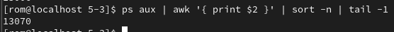
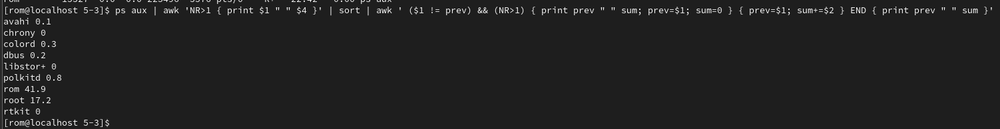
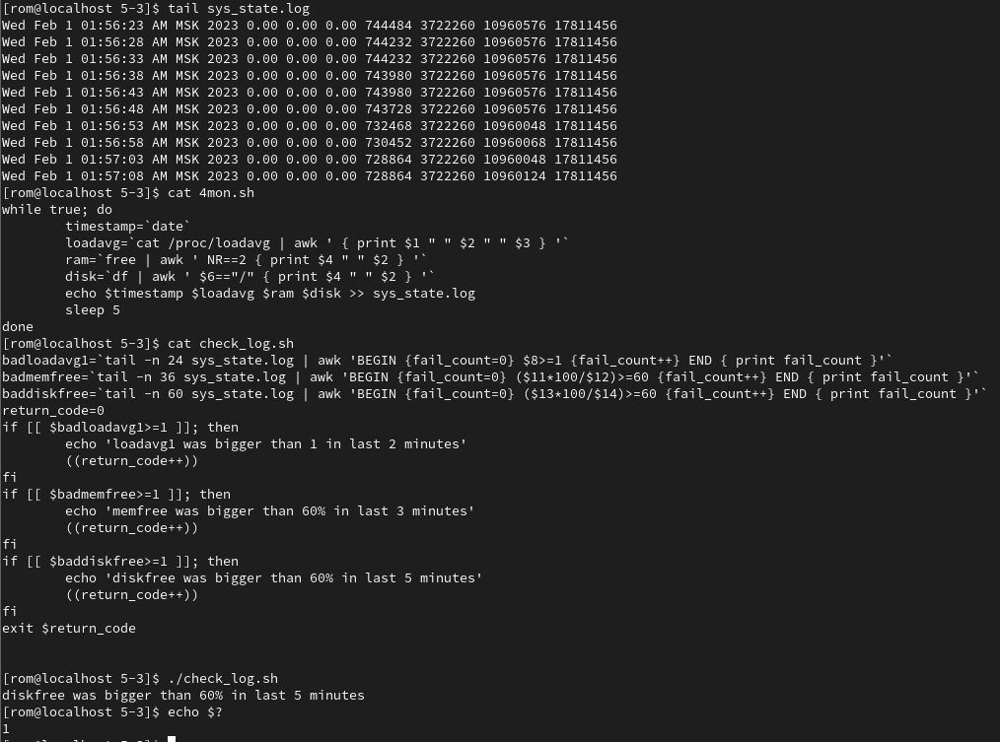

# Домашнее задание к занятию "Regexp и его использование для синтаксического анализа"

------


### Задание 1.

Напишите регулярное выражение для проверки является ли строка `IPv4` адресом.

Для тестов можно использовать файл со следующим содержимым, фильтруя вывод с помощью команды `grep -E`:
```
192.168.0.1
127.0.0.1
84.345.23.11
88.3A.56.76
224.12.76
```

*Пришлите получившееся выражение в качестве ответа.*

`grep -E "((25[0-5]|2[0-4][0-9]|[01]?[0-9][0-9]?)(\.|\b)){4}" iptest`

---

### Задание 2.

В Вашей конфигурации Nginx скопилось много неиспользуемых сегментов и становится сложно его читать.

Используя `sed` удалите все пустые строки и комментарии в конфигурации Nginx.

Попробуйте сделать это одним запуском.

Файл расположен по [ссылке](5-03/nginx.conf)


*Пришлите получившуюся команду в качестве ответа*

`cat nginx.conf | sed -E '/(^\s*#|^\s*$)/d'`

------

### Задание 3.

Используя `awk` и `ps aux` соберите информацию о:
 - количестве процессов для каждого пользователя;
 
 - процессе с самым большим PID;
 
 - (дополнительное задание со звездочкой*) суммарном использовании памяти различными пользователями.
 `ps aux | awk 'NR>1 { print $1 " " $4 }' | sort | awk ' ($1 != prev) && (NR>1) { print prev " " sum; prev=$1; sum=0 } { prev=$1; sum+=$2 } END { print prev " " sum }'`
 


*Пришлите скриншоты со скриптами и демонстрацией их работы*

---

## Дополнительные задания (со звездочкой*)
Эти задания дополнительные (не обязательные к выполнению) и никак не повлияют на получение вами зачета по этому домашнему заданию. Вы можете их выполнить, если хотите глубже и/или шире разобраться в материале.

### Задание 4.

Напишите bash-скрипт который собирает информацию о системе и пишет ее в лог каждые 5 секунд.

Используемые параметры:

- loadavg[1,5,15] средний показатель загрузки ЦПУ за последние 1 5 и 15 минут. *Примечание:* хранится в `/proc/loadavg`.
- memfree количество свободной оперативной памяти в байтах. *Примечание:* используем утилиту `free`.
- memtotal количество всей оперативной памяти в байтах. *Примечание:* используем утилиту `free`.
- diskfree свободное место на диске подключенного к /. *Примечание:* используем утилиту `df`.
- disktotal общий объем диска подключенного к /. *Примечание:* используем утилиту `df`.

***Формат записи:*** `timestamp loadavg1 loadavg5 loadavg15 memfree memtotal diskfree disktotal`

Пособирайте данные в течении 5-10 минут.

Анализируя этот лог с помощью `awk` напишите скрипт проверки состояния системы с заданными условиями:

- `loadavg1 < 1` в течении последних 2 минут;
- `memfree / memtotal < 60%` в течении последних 3 минут;
- `diskfree / disktotal < 60%` в течении последних 5 минут.

Скрипт должен возвращать 0 код ответа, если все условия выполняются, и любой другой в случае невыполнения.

В консоль также необходимо выводить, какое именно из условий не выполняется.

*Пришлите получившиеся скрипты в качестве ответа.*

[Скрипт для записи лога](code/5-03/4mon.sh)
[Скрипт для анализа лога](code/5-03/check_log.sh)

 

------